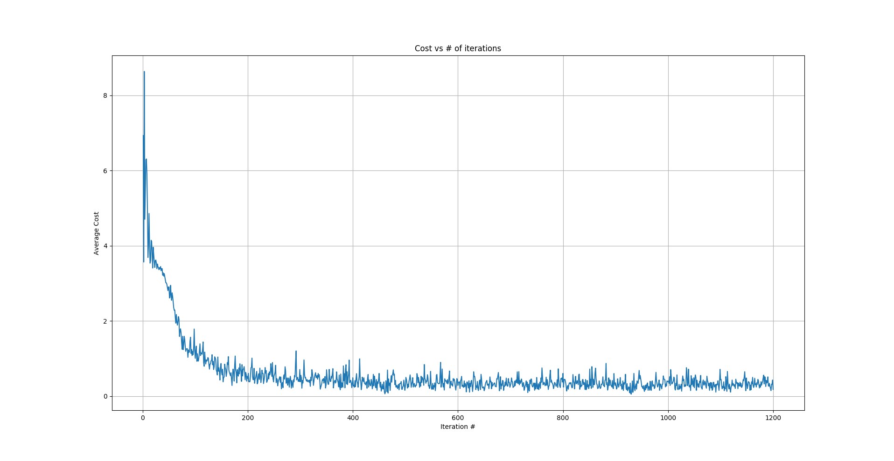

# MNIST
In this project, I practice implementing various different methods for digit recognition (using the MNIST database) without use of high level libraries. Apart from visualization libraries, only numpy is used.

Data is taken from http://yann.lecun.com/exdb/mnist/index.html

For a quick demo you may check out the [Notebook](Notebook.ipynb).

## Fully Connected Neural Network Structures
Linear regression with momentum achieves 9% error rate in 300 iterations

Linear regression with ADAM optimization and mini-batch size of 256 achieves 9.8% error rate in 300 iterations

Linear regression with ADAM optimization and batch-gradient descent achieves 9.2% error rate in 300 iterations

3-Layer NN with hidden units: (300,ReLU), (40, ReLU), ADAM optimization and mini-batches of 128 achieves 5.4% error rate in 1200 iterations

7-Layer NN with hidden units: (2000,ReLU), (1500,ReLU), (1000,ReLU), (500,ReLU), (100,ReLU), (40, ReLU) and ADAM optimization (with various different minibatch sizes during the whole training) achieves 1.86% error rate. 

Sample cost function graph:

## k-Nearest Neighbor

|  k |   accuracy  | accuracy (w/ weights) |
|----|-------------|-----------------------|
|  1 |      96.91% |                96.91% |
|  2 |      96.64% |                96.91% |
|  3 |      97.14% |                97.06% |
|  4 |      96.98% |                97.24% |
|  5 |      96.91% |                97.16% |
|  6 |      96.93% |                97.18% |
|  7 |      96.92% |                97.16% |
|  8 |      96.85% |                97.19% |
|  9 |      96.66% |                97.09% |
| 10 |      96.73% |                96.96% |
| 11 |      96.69% |                96.98% |
| 12 |      96.60% |                96.94% |
| 13 |      96.56% |                96.89% |
| 14 |      96.42% |                96.82% |
| 15 |      96.35% |                96.81% |
| 16 |      96.35% |                96.71% |
| 17 |      96.33% |                96.68% |
| 18 |      96.35% |                96.63% |
| 19 |      96.30% |                96.64% |
| 20 |      96.22% |                96.61% |

So, we see that optimal choices of k are 3 and 4 depending on whether we are using a weighted voting system or not.
(The weights we use are as follows: the nearest neighbor has k votes, the second closest neighbor has (k-1) votes and so on.)
